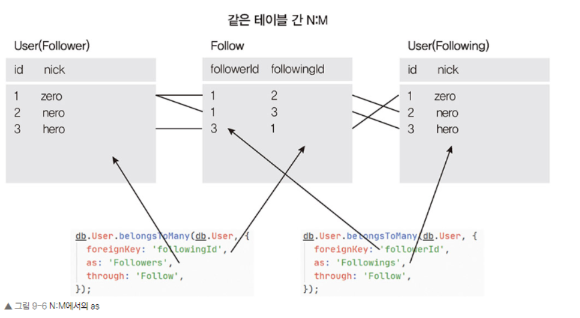
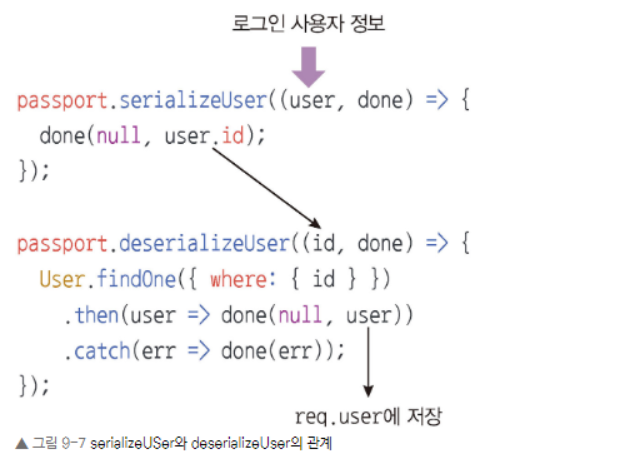

9.1 프로젝트 구조 갖추기
npm i sequelize mysql2 sequelize-cli 명령어를 호출하면 node_modules 폴더와 package-lock.json이 생성됩니다. 또한, npx sequelize init 명령어를 호출하면 config, migrations, models, seeders 폴더가 생성됩니다

9.2 데이터베이스 세팅하기

Follow 모델에서 사용자 아이디를 저장하는 컬럼 이름이 둘 다 UserId면 누가 팔로워고 누가 팔로잉 중인지 구분되지 않으므로 따로 설정해야 합니다.foreignKey 옵션에 각각 followerId, followingId를 넣어줘서 두 사용자 아이디를 구별했습니다.

through 옵션을 사용해 생성할 모델 이름을 Follow로 정했습니다. 같은 테이블 간의 N:M 관계에서는 as 옵션도 넣어야 합니다. 둘 다 User 모델이라 구분되지 않기 때문입니다. 주의할 점은 as는 foreignKey와 반대되는 모델을 가리킨다는 것입니다.

User 모델과 Post 모델은 1(User):N(Post) 관계이므로 belongsTo로 연결되어 있습니다. 시퀄라이즈는 Post 모델에 User 모델의 id를 가리키는 UserId 컬럼을 추가합니다. 어디에 컬럼이 추가되는 것인지는 관계를 생각해보면 쉽습니다. 사용자가 한 명이고 그에 속한 게시글이 여러 개이므로 각각의 게시글에 게시글의 주인이 누구인지 넣어야 합니다. belongsTo는 게시글에 붙습니다. post.getUser, post.addUser와 같은 관계 메서드가 생성됩니다.

콘솔에서 npx sequelize db:create 명령어를 입력하면 데이터베이스가 생성됩니다.

9.3 Passport 모듈로 로그인 구현하기
 npm i passport passport-local passport-kakao bcrypt
패키지를 설치합니다.
passport.initialize 미들웨어는 요청(req 객체)에 passport 설정을 심고, passport.session 미들웨어는 req.session 객체에 passport 정보를 저장합니다. req.session 객체는 express-session에서 생성하는 것이므로 passport 미들웨어는 express-session 미들웨어보다 뒤에 연결해야 합니다.

serializeUser는 사용자 정보 객체를 세션에 아이디로 저장하는 것이고, deserializeUser는 세션에 저장한 아이디를 통해 사용자 정보 객체를 불러오는 것입니다. 세션에 불필요한 데이터를 담아두지 않기 위한 과정입니다.

serializeUser는 로그인 시 실행되며, req.session(세션) 객체에 어떤 데이터를 저장할지 정하는 메서드입니다. 매개변수로 user를 받고 나서, done 함수에 두 번째 인수로 user.id를 넘기고 있습니다.serializeUser가 로그인 시에만 실행된다면 deserializeUser는 매 요청 시 실행됩니다. passport.session 미들웨어가 이 메서드를 호출합니다. serializeUser의 done의 두 번째 인수로 넣었던 데이터가 deserializeUser의 매개변수가 됩니다. 

라우터에 접근 권한을 제어하는 미들웨어가 필요합니다. 미들웨어를 만들어보며 Passport가 req 객체에 추가해주는 req.isAuthenticated 메서드를 사용

9.3.1
